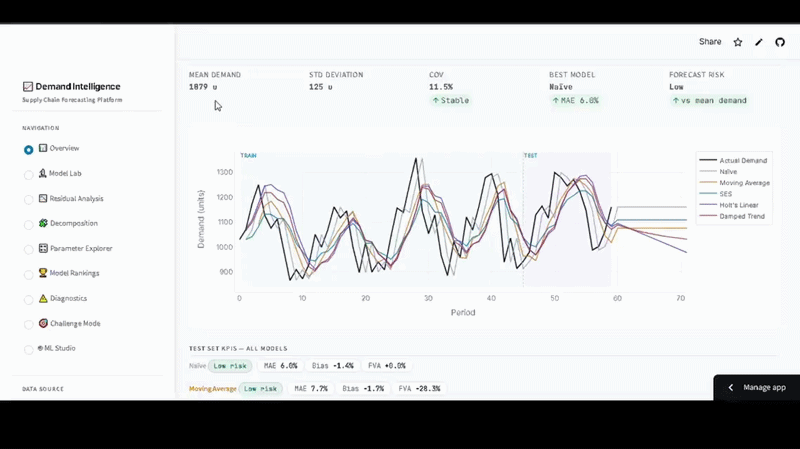

# Supply Chain Data Science — Salzburg


> A progressive portfolio built alongside EM CDE studies at the University of Salzburg,
> covering demand forecasting, ML models, and geospatial EUDR compliance risk scoring
> for FMCG supply chains.

[](https://demandforecastinglab.streamlit.app/)

---

## Demand Forecasting Intelligence Platform

Most supply chain forecasters are making their accuracy worse — not better. Applying the wrong model to the wrong demand shape introduces error that wasn't there. High-alpha smoothers chase randomness instead of signal. Optimising without a holdout test leads to overfitting.

This is called **negative Forecast Value Added (FVA)** — and it happens more than most planning teams admit.

To fix this, I built an interactive diagnostic sandbox — a *"flight simulator" for demand planners* — to see exactly how algorithms react to data without risking company inventory.

**What it does:**

- 🔹 **Generate** any demand profile (trend, seasonality, noise, outliers)
- 🔹 **Run 5 classical models** simultaneously (Naïve, MA, SES, Holt's, Damped Trend)
- 🔹 **Track real-time KPIs** — MAE, Bias, and FVA vs the Naïve benchmark
- 🔹 **Tune parameters live** and watch the model's "memory" shift on the graph
- 🔹 **Upload your own CSV** to test these algorithms on your actual company data

No black boxes. Understand what your multi-million dollar ERP is doing under the hood.

> 🔜 **Coming next:** LLM-based optimisation engine + **ML Studio** update bringing XGBoost and LightGBM into the platform to compare classical statistics against modern Machine Learning.

### 📊 Visual Results

<table>
  <tr>
    <td align="center"><b>Demand Forecasting with Confidence Intervals</b></td>
    <td align="center"><b>Moving Average Window Comparison</b></td>
  </tr>
  <tr>
    <td></td>
    <td></td>
  </tr>
  <tr>
    <td align="center"><b>Forecast Error Analysis</b></td>
    <td align="center"><b>Forecast Accuracy Comparison</b></td>
  </tr>
  <tr>
    <td></td>
    <td></td>
  </tr>
</table>

### Demo



---

## About

This repository documents a structured learning and building journey at the intersection of:

- **Supply chain demand forecasting** — statistical and ML models applied to FMCG contexts
- **Geospatial AI** — satellite-based supplier risk scoring using Google Earth Engine
- **EUDR compliance** — automated deforestation risk assessment for ingredient procurement

Previously co-developed [GeoGemma](https://github.com/GeoGemma/GeoGemma-APAC-2025) —
winner of **Best AI Use Case** at the Google & ADB Asia-Pacific Solution Challenge 2024 —
a geospatial LLM built on Google Earth Engine. This repository applies those geospatial
methods to supply chain compliance and demand forecasting.

---

## Repository Structure

```
supply-chain-ds-salzburg/
│
├── 01_statistical_forecasting/     # Part I: Classical forecasting models
│   ├── 01_moving_average.ipynb
│   ├── 02_exponential_smoothing.ipynb
│   ├── 03_double_exponential_smoothing.ipynb
│   ├── 04_triple_exponential_smoothing.ipynb
│   ├── 05_outlier_handling.ipynb
│   ├── 06_forecast_kpis.ipynb
│   ├── app.py                      # Streamlit demand intelligence dashboard
│   └── README.md
│
├── 02_machine_learning/            # Part II: ML models for demand forecasting
│   ├── 01_decision_trees.ipynb
│   ├── 02_random_forests.ipynb
│   ├── 03_xgboost_forecasting.ipynb
│   ├── 04_external_demand_drivers.ipynb
│   ├── 05_neural_networks.ipynb
│   └── README.md
│
├── 03_eudr_supplier_risk/          # Part III: Geospatial EUDR compliance tool
│   ├── 01_gee_forest_data_pipeline.ipynb
│   ├── 02_supplier_deforestation_scoring.ipynb
│   ├── 03_risk_score_to_supply_volatility.ipynb
│   └── README.md
│
├── 04_integrated_tool/             # Part IV: End-to-end pipeline + dashboard
│   ├── pipeline.py
│   ├── dashboard.py
│   ├── case_study.md
│   └── README.md
│
├── data/
│   ├── raw/                        # Original downloaded datasets
│   ├── processed/                  # Cleaned, model-ready data
│   └── data_sources.md             # Dataset origins and licenses
│
├── requirements.txt
├── .gitignore
└── README.md                       # This file
```

---

## Architecture


---

## Roadmap

| Month | Focus | Status |
|-------|-------|--------|
| April 2025 | Statistical forecasting models (Part I) | ✅ Complete |
| May–June 2025 | ML models — XGBoost, external drivers (Part II) | 🔄 Partial (3/5 notebooks done) |
| July 2025 | EUDR geospatial supplier risk pipeline (Part III) | ✅ Complete (2/3 notebooks done) |
| August 2025 | Integrated tool + dashboard + case study (Part IV) | ✅ Complete |

---

## Stack

```
Python 3.10+      pandas / numpy / matplotlib / scipy
scikit-learn      Decision trees, random forests, clustering
XGBoost           Gradient boosting for demand forecasting
Plotly            Interactive charts (demand intelligence dashboard)
Google Earth Engine  Satellite imagery & deforestation data
Streamlit         Interactive dashboard
Jupyter           All notebooks
```

---

## Key References

- EU Regulation (EU) 2023/1115 — EU Deforestation Regulation (EUDR)
- Google Earth Engine — [earthengine.google.com](https://earthengine.google.com)
- AlphaEarth Foundations — [Scaling Transparency: Annual Pan-Tropical Commodity Maps](https://medium.com/google-earth/scaling-transparency-annual-pan-tropical-commodity-maps-powered-by-alphaearth-foundations-5f4066b5dd13)
- Global Forest Watch — [globalforestwatch.org](https://www.globalforestwatch.org)

---

## Contact

**Hanzila Bin Younus**
EM CDE Student — University of Salzburg
[LinkedIn](https://linkedin.com/in/hanzila-bin-younus-geogemma) · [GeoGemma](https://github.com/GeoGemma/GeoGemma-APAC-2025)
